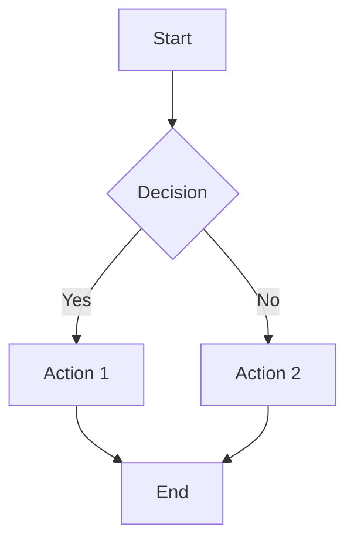

# Understanding Hugo-Generated Documentation

This guide explains how the FileBrowser Quantum documentation is structured using Hugo and the custom theme.

## Hugo Theme

The documentation uses a custom Hugo theme based on [Lotus Docs](https://lotusdocs.dev/), a modern documentation theme for Hugo. The theme provides:

### Getting Help with Lotus Docs

For detailed theme documentation and advanced features, visit the [Lotus Docs website](https://lotusdocs.dev/). The official documentation includes:

- **Configuration options** - All available parameters
- **Customization guides** - Styling and theming
- **Shortcode examples** - How to use custom shortcodes
- **Deployment guides** - Platform-specific instructions
- **Advanced features** - Search, analytics, and more

### Using Theme Features

#### Custom Shortcodes

Lotus Docs provides powerful shortcodes for enhanced content:

**Alerts:**

The theme supports multiple alert types with automatic icons:

{}
This is an informational alert with automatic icon.
{}

{}
This is a warning alert with automatic icon.
{}

{}
This is a success alert with automatic icon.
{}

{}
This is a danger alert with automatic icon.
{}

{}
This is a primary alert with automatic icon.
{}

{}
This is a default alert with automatic icon.
{}

**Alert Types and Icons:**

| Type | Icon | Use Case |
|------|------|----------|
| `info` | ℹ️ info | General information, tips, notes |
| `warning` | ⚠️ warning | Important notices, cautions |
| `success` | ✅ check_circle | Success messages, confirmations |
| `danger` | ❌ report | Errors, critical issues, failures |
| `primary` | ℹ️ info | Primary information, highlights |
| `default` | 🔔 notifications | General notifications, updates |

**Alert Customization:**

You can customize alerts with custom icons and titles:

{}
**Custom Title:** This alert uses a custom star icon instead of the default info icon.
{}

{}

**Rich Content Alerts:**

For detailed alerts with titles and multiple paragraphs:

{}
**Note:** If you are using Docker, you need to mount a volume with the `branding` directory in order for it to be accessible from within the container.

This is a second paragraph in the same alert. You can include multiple lines of text, code examples, and even lists.

- First item
- Second item
- Third item
{}

{}
**Important:** This is a warning with multiple sections.

The first paragraph explains the main issue.

The second paragraph provides additional context and details about what might happen if you don't follow the instructions.

**Code Example:**
```bash
docker run -v /path/to/branding:/app/branding filebrowser
```
{}

**Tabs:**

Create interactive tabbed content for organizing related information:



```bash
docker run -p 8080:8080 filebrowser
```


```bash
./filebrowser -c config.yaml
```



**Advanced Example with Right-Aligned Tab:**



Installation instructions and setup guides for different platforms.


Configuration options and customization settings.


Advanced settings and enterprise features.



**Code Highlighting:**

The theme supports both **PrismJS fenced code blocks** and **Hugo highlight shortcode with line numbers**:

**PrismJS Fenced Code Blocks (Recommended for simple highlighting):**

```yaml
server:
  port: 8080
  sources:
    - path: "/data"
```

**Hugo Highlight Shortcode with Line Numbers:**


server:
  port: 8080
  sources:
    - path: "/data"


#### Table of Contents

Enable TOC on any page by adding `toc: true` to the front matter.

#### Custom Icons

Use Material Symbols icons in front matter by adding `icon: "icon_name"`.

Available icon categories:
- Navigation: `home`, `menu`, `arrow_back`
- Actions: `play_arrow`, `pause`, `stop`
- Content: `article`, `code`, `image`
- Communication: `chat`, `email`, `phone`
- And many more...

#### Math Equations

Use KaTeX for mathematical expressions. **Important:** You must add `katex: true` to your page's front matter to enable KaTeX rendering.

**Inline Math:**
Inline math: $E = mc^2$

**Block Math:**
$$
\int_{-\infty}^{\infty} e^{-x^2} dx = \sqrt{\pi}
$$

**KaTeX Shortcode (for complex equations):**


$$
\begin{array} {lcl}
  L(p,w_i) &=& \dfrac{1}{N}\Sigma_{i=1}^N(\underbrace{f_r(x_2 \rightarrow x_1 \rightarrow x_0)G(x_1 \longleftrightarrow x_2)f_r(x_3 \rightarrow x_2 \rightarrow x_1)}_{sample\, radiance\, evaluation\, in\, stage2})
\end{array}
$$


#### Mermaid Diagrams

Create diagrams with Mermaid using fenced code blocks:



## Building Documentation

### Using Makefile

The easiest way to build and serve the documentation locally:

Run `make dev` to:
- Start a local Hugo development server
- Enable live reloading when files change
- Serve the documentation at `http://localhost:1313`

### Manual Hugo Commands

If you prefer to use Hugo directly:

- `hugo server` - Serve locally with live reload
- `hugo` - Build static site
- `hugo --extended` - Build with extended features

## Documentation Structure

### File Organization

The documentation follows a hierarchical structure:
- `_index.md` files serve as section homepages
- Individual pages are organized in logical directories
- Subdirectories group related content
- Each section has its own `_index.md` for navigation

### Required Front Matter

Every documentation page must include front matter with these attributes:
- `title` - Page title (required)
- `description` - Brief description (required)
- `icon` - Material icon name (required)
- `date` - Publication date (required)
- `lastmod` - Last modification date (required)

## Required Attributes

### Title
- **Required**: Yes
- **Purpose**: Page title displayed in navigation and browser tab
- **Format**: String, should be descriptive and concise
- **Example**: `"Docker Installation"`

### Description
- **Required**: Yes
- **Purpose**: Brief description used in navigation and search
- **Format**: String, 1-2 sentences
- **Example**: `"Install FileBrowser using Docker containers"`

### Icon
- **Required**: Yes
- **Purpose**: Material Design icon displayed in navigation
- **Format**: String, Material icon name
- **Examples**: 
  - `"rocket_launch"` - Getting started
  - `"settings"` - Configuration
  - `"api"` - API reference
  - `"security"` - Access control
  - `"help"` - Help topics

### Date
- **Required**: Yes
- **Purpose**: When the article was first published/created
- **Format**: ISO 8601 date string (RFC 3339)
- **Examples**: 
  - `"2024-01-15T10:00:00Z"` - January 15, 2024 at 10:00 AM UTC
  - `"2024-03-20T14:30:00-05:00"` - March 20, 2024 at 2:30 PM EST
- **Usage**: Used for sorting, RSS feeds, and showing publication date
- **Note**: This should remain constant - only change if you're republishing an existing article

### Last Modified (lastmod)
- **Required**: Yes
- **Purpose**: When the article was last updated/modified
- **Format**: ISO 8601 date string (RFC 3339)
- **Examples**: 
  - `"2024-10-08T18:30:00Z"` - October 8, 2024 at 6:30 PM UTC
  - `"2024-12-01T09:15:00-08:00"` - December 1, 2024 at 9:15 AM PST
- **Usage**: Used for showing "last updated" information, sitemaps, and cache invalidation
- **Note**: Update this every time you make changes to the content

### Draft
- **Required**: No (defaults to false)
- **Purpose**: Controls whether the page is published
- **Format**: Boolean (true/false)
- **Usage**: Set to `true` while working on content, `false` when ready to publish
- **Note**: Draft pages are not included in the built site

## Extended Hugo Version

The documentation requires **Hugo Extended** version because:

1. **SCSS/SASS Support** - The theme uses SCSS for styling
2. **Advanced Features** - Extended version includes additional processing capabilities
3. **Theme Compatibility** - The custom theme requires extended features

### Checking Your Hugo Version

Run `hugo version` and look for `extended` in the output:
```
hugo v0.121.0+extended darwin/arm64 BuildDate=2024-01-01T00:00:00Z
```

### Installing Hugo Extended

**macOS (Homebrew):** `brew install hugo`

**Windows (Chocolatey):** `choco install hugo-extended`

**Linux:** Download from GitHub releases and install the extended version

**Docker:** `docker run --rm -it -v $(pwd):/src -p 1313:1313 klakegg/hugo:extended server`

## Common Issues

### Build Failures

If you encounter build issues:

1. **Check Hugo Version**: Ensure you have Hugo Extended
2. **Theme Issues**: The theme might need updates
3. **Dependencies**: Missing Hugo modules

### Getting Help

If you're unable to build the documentation:

1. **Check Requirements**: Ensure Hugo Extended is installed
2. **Update Dependencies**: Run `hugo mod get -u`
3. **Open an Issue**: Create an issue on the repository with:
   - Your Hugo version (`hugo version`)
   - Operating system
   - Error messages
   - Steps to reproduce

### Theme Issues

The documentation uses a custom theme. If you encounter theme-related issues:

1. **Theme Updates**: The theme might need updates
2. **Compatibility**: Check Hugo version compatibility
3. **Report Issues**: Open an issue with theme-specific problems

## Development Workflow

### Making Changes

1. **Edit Files**: Modify content in english `content/en/docs`
2. **Preview Changes**: Run `make dev` to see changes live
3. **Translate**: Export DEEPL_API_KEY and run `make sync-translations` to sync english changes to target languages
4. **Manually Verify**: adjust target translations as needed.
5. **Commit Changes**: Submit pull request with your changes

### Adding New Pages

1. **Create File**: Add new `.md` file in appropriate directory
2. **Add Front Matter**: Include all required attributes
3. **File Structure**: Place file in appropriate directory for automatic ordering
4. **Add to Index**: Update `_index.md` if needed
5. **Test**: Verify page appears in correct location

### Updating Existing Pages

1. **Edit Content**: Modify the markdown content
2. **Update lastmod**: Always update the `lastmod` field to current date/time
3. **Update Front Matter**: Adjust title or description if needed
4. **Test Changes**: Use `make dev` to preview
5. **Translate**: Export DEEPL_API_KEY and run `make sync-translations` to sync english changes to target languages
6. **Manually Verify**: adjust target translations as needed.
7. **Submit PR**: Create pull request with changes

### Managing Dates

**When creating new content:**
- Set `date` to when you first publish the article
- Set `lastmod` to the same value initially
- Use ISO 8601 format: `"2024-01-15T10:00:00Z"`

**When updating existing content:**
- Keep `date` unchanged (original publication date)
- Update `lastmod` to current date/time
- This helps users see when content was last updated

**Date Format Examples:**
```yaml
# UTC timezone
date: "2024-01-15T10:00:00Z"
lastmod: "2024-10-08T18:30:00Z"

# With timezone offset
date: "2024-01-15T10:00:00-05:00"  # EST
lastmod: "2024-10-08T18:30:00-05:00"  # EST

# Date only (Hugo will assume midnight UTC)
date: "2024-01-15"
lastmod: "2024-10-08"
```

## Best Practices

### Content Guidelines

- **Clear Titles**: Use descriptive, concise titles
- **Good Descriptions**: Write helpful descriptions for navigation
- **Appropriate Icons**: Choose icons that represent the content

### File Organization

- **Group Related Content**: Keep related pages in the same directory
- **Use Subdirectories**: Organize complex sections with subdirectories
- **Consistent Naming**: Use kebab-case for file names
- **Index Pages**: Include `_index.md` for each section

### Writing Style

- **Clear and Concise**: Write for users of all technical levels
- **Code Examples**: Include working code examples
- **Cross-References**: Link to related pages
- **Consistent Formatting**: Follow existing formatting patterns

## Multilingual Support (i18n)
- 

## Next Steps


- 
- 
- 
