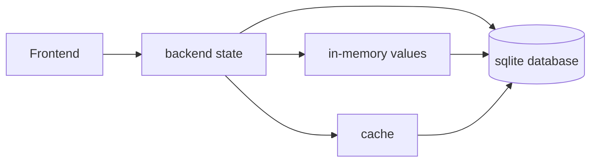

FileBrowser Quantum **v2.0.0** is the largest upgrade to date. It modernizes persistence, configuration, permissions, and API shapes so the application can support richer features going forward.

{}
**Upgrading from v1.x?**

v2.0.0 **requires** a config update and a one-time database migration. Back up your `database.db` before upgrading and follow the  step by step.
{}

## Why v2.0.0?

Earlier releases stored application state in BoltDB (`database.db`) using Storm-style key/value buckets. Every read and write went through that embedded database directly. v2.0.0 moves to **SQLite** with a structured schema and a new **`state` package** that sits between handlers and disk.

This foundation unlocks:

- **Activity logging** — charts, historical data, and reporting (requires structured SQL storage)
- **Richer permission and access queries** — nuanced lookups across users, scopes, and rules with less overhead than repeated BoltDB key/value reads
- **Better resource usage and performance** — layered caching (runtime maps + TTL caches) with write-through SQLite persistence
- **Cleaner configuration** — HTTP settings separated from server settings, structured `userDefaults`
- **Standardized APIs** — consistent request/response shapes, Swagger updates, and removal of legacy aliases

Per-source access rules and scoped permissions existed in v1.x, but state lived entirely in BoltDB-backed in-memory structures. v2.0.0 keeps hot paths fast while SQLite makes cross-entity queries, history, and new features like activity logs practical.

## New state management architecture

v2.x.x introduces **write-through backend state management**:

**How it differs from v1.x BoltDB:**

| v1.x (BoltDB / Storm) | v2.x (SQLite + state) |
|---|---|
| Key/value buckets queried on many code paths | Relational tables with typed rows |
| In-memory access data loaded from BoltDB; repeated disk reads on cache miss | Runtime maps for shares, access rules, and index metadata; user records in a 30-minute TTL cache (go-cache) with SQLite fallback |
| Harder to add cross-entity queries (activity, reports) | SQL enables joins, history, and structured migrations |
| Scattered persistence calls | Single `state` gateway — all durable writes go through one layer |

The `state` package uses **two caching strategies**, not one:

- **Runtime maps** — shares, access rules, groups, token hashes, and index metadata are loaded at startup and kept in memory for the process lifetime. Reads hit memory; writes go to memory and SQLite together (write-through).
- **TTL cache (go-cache)** — user records are cached temporarily (30 minutes). On a cache miss or expiry, the record is loaded from SQLite, then cached again. This avoids holding every user in memory indefinitely while still reducing disk reads on hot paths.

All durable mutations write through to SQLite so restarts recover consistent state. Legacy BoltDB is only read once — during the one-time migration via `migrateFrom` — then SQLite becomes the sole database.

## Breaking changes (summary)

| Area | What changed |
|---|---|
| **Database** | BoltDB → SQLite. Rename `FILEBROWSER_DATABASE` → `FILEBROWSER_DATABASE_PATH` (point at your new `.sqlite` file). One-time import via `server.database.migrateFrom`. |
| **Permissions** | File permissions (**view**, **download**, **modify**, **create**, **delete**) are **per source**, not global. **`view` is new in v2.0.0** — in v1.x, browsing a scope was always allowed. Global permissions are **admin**, **api**, **share**, **realtime** only. |
| **Config** | Deprecated `userDefaults` and flat config formats removed. HTTP options moved from `server` to `http`. Use the config migration tool before upgrading. |
| **API routes** | `GET /api/raw` removed → use `/api/resources/download`. Share URLs must use `/public/share/…` directly. Stream endpoint → `/api/media/stream`. |
| **API methods** | `PUT /api/users` → `PATCH`. User updates are granular (partial payloads, not full user objects). |
| **API identifiers** | `user.id` is a backend property; frontend APIs query users by **username**. Swagger updated. |
| **Search API** | Singular `source` param removed (use `sources`). Bare `scope` paths require `sourceName:` prefix. `glob` / `useGlob` → `useWildcard`. |
| **Config rules** | `config.conditionals` removed. Source-level `indexingIntervalMinutes` removed (adaptive scheduling). Rule fields `fileNames` / `folderNames` / top-level `hidden` → `config.rules` with `fileName`, `folderName`, `ignoreHidden`. |
| **CLI** | User commands → `user set` / `user promote`; `set -u` deprecated. See . |
| **Env vars** | `FILEBROWSER_DATABASE` removed. Use `FILEBROWSER_DATABASE_PATH` or `server.database.path`. |

## API and response cleanup

v2.0.0 standardizes several API conventions that were inconsistent in v1.x:

- **Removed legacy properties** from API responses and generated config output
- **Users addressed by username** in frontend-facing APIs (not numeric `id`)
- **Partial user updates** via `PATCH` — send only the fields you want to change
- **View vs download** — separate permission grants; `/api/resources/view` for inline non-media viewing, `/api/media/stream` for audio/video with range-based chunking (both use `viewToken` from file metadata)
- **Cleaner Swagger** — reflects current shapes without deprecated fields

If you maintain scripts or integrations, review the updated Swagger page at `/swagger` after upgrading.

## New features

- **Activity logs** — user activity charts, historical data, activity tool, and reports
- **Per-source permissions** — view, download, modify, create, delete per scope; defaults in Settings → Access management
- **User defaults editor** — admin controls for universal defaults and enforced preferences in the UI
- **View vs download** — separate grants for browsing and downloading files
- **Media player improvements** — playback queue UI, loop modes (off/single/all), audio visualizer, gesture controls, fullscreen/PiP resume on navigation
- **WebDAV** — set modification time via `X-OC-Mtime` header; copy preserves file modification times
- **Copy operations** — preserve original modification times in WebUI (WebDAV COPY: files only)
- **CLI improvements** — `user set` with `--password` (inline, prompt, or piped stdin); `user promote` for admin without password reset
- **Deployment analytics** (opt-in) — anonymized monthly config snapshot with in-app preview
- **UI** — refreshed dropdown and input styles

## Before you upgrade

1. **Back up** your `database.db` file to a safe location
2. **Read the migration guide** — upgrading is a multi-phase process, not a simple image tag change
3. **Plan for rollback** — keep the old database backup until you have validated the migration

## Next steps

-  — step-by-step upgrade from v1.x
-  — per-source permissions in v2.0.0+
-  — updated user commands
-  — common issues after upgrade
