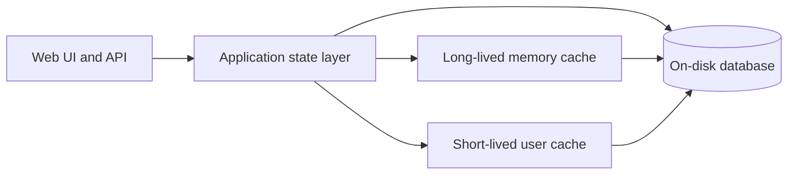

FileBrowser Quantum **v2.0.0** is the largest upgrade to date. It refreshes how settings, users, and history are stored, simplifies configuration, and reshapes permissions so the product can grow without hitting the limits of the old design.

{}
**Upgrading from v1.x?**

v2.0.0 **requires** a config update and a one-time database migration. Back up your `database.db` before upgrading and follow the  step by step.
{}

## Why v2.0.0?

Previously, everything was kept in a simple database that organized data as key/value pairs. That worked well for the original file browser, but it was a poor fit for richer features — activity history, reporting, and fine-grained permission lookups all need structured data that is easy to query and retain over time.

v2.0.0 replaces that layout with a structured on-disk database and a dedicated state management layer (described ). The goal is better performance at scale and room for features the old format could not support cleanly, while keeping everyday browsing fast.

## Feature spotlights

The guides below cover v2.0.0's largest additions in depth. For the full release list — media player updates, WebDAV, CLI changes, breaking changes, and more — see the .


Per-source view, download, modify, create, and delete — defaults, enforcement, and which Settings page to use.



Universal profile template for new users — enforce theme, preview, and global permission defaults.



Audit log with charts and CSV export — what is recorded, retention, and report modes.


## Breaking changes

{}
v2.0.0 includes many breaking changes. Read the release notes carefully before upgrading.
{}

Review the full list in the  and make sure you understand what affects your deployment before upgrading. The  walks through the upgrade steps.

## API and response cleanup

v2.0.0 standardizes several API conventions that were inconsistent in v1.x:

- **Removed legacy properties** from API responses and generated config output
- **Users addressed by username** in frontend-facing APIs (not numeric `id`)
- **Partial user updates** via `PATCH` — send only the fields you want to change
- **View vs download** — separate permission grants; `/api/resources/view` for inline non-media viewing, `/api/media/stream` for audio/video with range-based chunking (both use `viewToken` from file metadata)
- **Cleaner Swagger** — reflects current shapes without deprecated fields

If you maintain scripts or integrations, review the updated Swagger page at `/swagger` after upgrading.

## New state management architecture

v2.x.x uses **write-through state management**: the application keeps working copies in memory for speed, and saves changes to the database as they happen so a restart does not lose work.

**How it differs from v1.x:**

| v1.x (BoltDB / Storm) | v2.x (SQLite + state) |
|---|---|
| Simple key/value storage — fine for basic settings, awkward for history and reports | Structured tables — suited to activity logs, user data, and complex queries |
| Data often re-read from disk when not already in memory | Hot data (shares, access rules, index metadata) stays in memory for the life of the process; user records use a timed cache with disk fallback |
| Hard to add features that span users, time ranges, or event types | Built for cross-user history, reporting, and safe schema upgrades |
| Updates could touch storage from many places | One state layer handles writes — easier to keep data consistent |

The state layer uses **two caching strategies**:

- **Long-lived memory cache** — shares, access rules, groups, token metadata, and index information load at startup and stay in memory. Reads are fast and writes update memory and disk together.
- **Short-lived user cache** — kept in memory only for a short time to prevent high access disk usage. This balances speed with memory use on busy instances.

Every change is written through to the on-disk database, so restarts recover a consistent picture. Your old `database.db` is read **once** during migration (`server.database.migrateFrom`); after that, v2 uses its own database file (see the ).

## Before you upgrade

1. **Back up** your `database.db` file to a safe location
2. **Read the migration guide** — upgrading is a multi-phase process, not a simple image tag change
3. **Plan for rollback** — keep the old database backup until you have validated the migration

## Next steps

-  — full v2.0.0 feature and fix list
-  — step-by-step upgrade from v1.x
-  — per-source view/download/modify/create/delete
-  — enforceable profile template
-  — audit log and reporting
-  — YAML config, CLI, and API reference
-  — updated user commands
-  — common issues after upgrade
